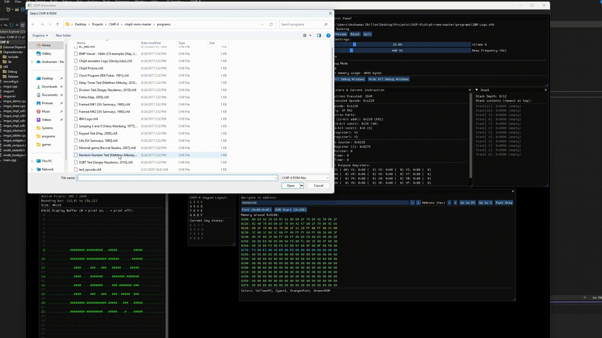

# CHIP-8 Emulator

A functional CHIP-8 interpreter with comprehensive debugging tools, built from scratch in C++ using SDL3 and Dear ImGui.


## Table of Contents

- [What is CHIP-8?](#what-is-chip-8)
- [Why CHIP-8?](#why-chip-8)
- [Key Features](#key-features)
- [How It Works](#how-it-works)
  - [CPU Instruction Processing](#cpu-instruction-processing)
  - [Memory Architecture](#memory-architecture)
  - [Graphics System](#graphics-system)
  - [Audio Implementation](#audio-implementation)
  - [Timing and Synchronization](#timing-and-synchronization)
  - [Debugging Infrastructure](#debugging-infrastructure)
- [Technical Implementation Details](#technical-implementation-details)
  - [Architecture Decisions](#architecture-decisions)
  - [Library Choices](#library-choices)
  - [Code Organization](#code-organization)
- [Project Structure](#project-structure)
- [Building the Project](#building-the-project)
  - [Prerequisites](#prerequisites)
  - [Running the Program](#running-the-program)
- [Usage](#usage)
- [What I Learned](#what-i-learned)
- [Known Issues](#known-issues)
- [Future Improvements](#future-improvements)
- [References](#references)

---

## What is CHIP-8?

CHIP-8 is a simple virtual machine and programming language that was originally developed in the 1970s for early personal computers. Unlike modern CPUs, CHIP-8 is an interpreted language. It's not actual hardware, but rather a virtual machine that runs on top of real hardware. This makes it an excellent starting point for learning about emulation and computer architecture.

The CHIP-8 system was designed to make it easy to port simple games across different computer platforms. Classic games like Pong, Tetris, Space Invaders, and Pac-Man were all implemented for CHIP-8. These games still run today on CHIP-8 interpreters, making them a perfect test case for emulation projects.

## Why CHIP-8?

I chose to implement a CHIP-8 interpreter because it's perfectly balanced in terms of simplicity and complexity. The system is small enough to understand fully (since it has only 35 instructions, 4KB of memory, and a 64x32 pixel display) but complex enough to demonstrate real emulation concepts like instruction decoding, memory management, and hardware timing.

My implementation runs CHIP-8 ROMs accurately at configurable speeds (typically 700 instructions per second), handles all original CHIP-8 instructions, and includes extensive debugging capabilities that go far beyond what most CHIP-8 interpreters offer.

## Key Features

**Core Emulation**
- Complete implementation of all 35 CHIP-8 instructions
- Accurate timing with configurable clock rates
- 4KB memory system with proper memory mapping
- 64x32 pixel monochrome display with XOR-based sprite drawing
- 16-key hexadecimal keypad input
- Sound system with configurable square wave generation

**Debugging Infrastructure**
- Real-time register and memory viewer
- Step-by-step instruction execution
- Assembly instruction decoder showing human-readable mnemonics
- Stack trace visualization
- Display buffer analysis with pixel counting and bounding box detection
- Keypad state monitoring
- Comprehensive execution statistics

**User Interface**
- Modern GUI built with Dear ImGui
- Resizable display viewport with automatic scaling
- File browser for loading ROMs
- Audio controls with volume and frequency adjustment
- Multiple debug windows that can be toggled independently

## How It Works

### CPU Instruction Processing

The core of any emulator is instruction processing. CHIP-8 instructions are 16-bit values that encode different operations. My emulator fetches instructions from memory, decodes them into their component parts (opcode, registers, addresses, constants), and executes the corresponding operation.

```cpp
switch ((chip8->inst.opcode >> 12) & 0x0F) {
        case 0x00:
        //rest of the opcodes and their implementation...
}
```

The switch-case structure in `emulate_instructions()` handles all 35 CHIP-8 instructions, from simple register operations to complex sprite drawing.



<details>
<summary><strong>Click to expand for more details about CPU instructions</strong></summary>
<br>
Like I mentioned before, the CHIP-8 instructions are 16-bit values that encode different operations using a carefully designed bit layout.

**Why Separate Into Components?**

Rather than having all 65,536 (2^16) opcodes, CHIP-8 uses a clever system where instructions share common bit patterns that encode operands directly within the instruction word. The system uses the upper 4 bits to identify the instruction family, then uses the remaining 12 bits to encode operands like register numbers, memory addresses, and constants. This approach dramatically reduces the complexity of both the interpreter and the instruction decoder.

For example, all arithmetic operations (ADD, SUB, AND, OR, XOR) start with `0x8`, but they use the lowest 4 bits to specify which operation to perform. Similarly, all instructions that load immediate values into registers start with `0x6`, but they use the middle and lower bits to specify which register and what value.

**Bit Layout and Extraction**

Every CHIP-8 instruction follows this 16-bit pattern:
```
15 14 13 12 | 11 10  9  8 | 7  6  5  4 | 3  2  1  0
   Opcode   |      X      |     Y      |     N
            |             |    NN  (8-bit address)
            |     NNN        (12-bit constant)
```

The bitwise operations extract these fields by using shifts and masks. The bit shift operation (`>>`) moves bits to the right, effectively dividing by powers of 2. The mask operation (`&`) keeps only the bits we want while zeroing out the rest.

Here's how each extraction works:

**X Register (bits 8-11):** `(opcode >> 8) & 0x0F`
- `>> 8` shifts the entire instruction right by 8 positions, moving bits 8-11 to positions 0-3
- `& 0x0F` keeps only the lowest 4 bits (binary 1111), giving us values 0-15

**Y Register (bits 4-7):** `(opcode >> 4) & 0x0F`  
- `>> 4` shifts right by 4 positions, moving bits 4-7 to positions 0-3
- The mask again keeps only 4 bits for register numbers 0-15

**12-bit Address (NNN):** `opcode & 0x0FFF`
- No shift needed since these are the lowest 12 bits
- `0x0FFF` in binary is 111111111111, keeping all 12 bits for addresses 0x000-0xFFF

**8-bit Constant (NN):** `opcode & 0x0FF`
- Keeps the lowest 8 bits for values 0x00-0xFF

**4-bit Constant (N):** `opcode & 0x0F`
- Keeps only the lowest 4 bits for values 0x0-0xF

This extraction happens once per instruction, then the decoder uses a switch statement on the opcode (upper 4 bits) to jump directly to the appropriate handler. Some instruction families like `0x8XXX` need additional decoding of the N field to determine the specific operation, but this two-level approach keeps the decoder both fast and readable.

It took me some time to understand the fact that a single 16-bit word contains both the operation to perform and all the data needed to perform it, and it seems to me now as a very elegant solution. I'm sure modern processors work in a similar way.

</details>

### Memory Architecture

CHIP-8 systems have a straightforward memory layout that I've implemented:

- **0x000-0x1FF**: Reserved area (where I store the font data)
- **0x200-0xFFF**: Program ROM and RAM space
- The system includes 16 general-purpose 8-bit registers (V0-VF), where VF serves double duty as a flags register
- A 16-bit index register (I) for memory addressing
- A program counter (PC) that tracks the current instruction
- A stack for subroutine calls with up to 12 levels of nesting

### Graphics System

The display system was one of the more interesting challenges. CHIP-8 has a 64x32 pixel monochrome display where sprites are drawn using XOR operations. This means drawing the same sprite twice in the same location will erase it, a feature that many classic games rely on for animation.

My implementation uses SDL3 for the underlying graphics, but I render the CHIP-8 display pixel-by-pixel in the ImGui viewport. Each CHIP-8 pixel becomes a rectangle that scales with the window size, maintaining the original 2:1 aspect ratio.

<details>
<summary><strong>Click to expand for more details about the graphics/display system</strong></summary>
<br>
The CHIP-8 graphics system is simple but elegant. The 64x32 pixel monochrome display uses XOR-based drawing, which creates unique visual effects that many classic games depend on.

**Understanding XOR Drawing**

When a sprite is drawn, each sprite pixel is XORed with the corresponding display buffer pixel using the operation `*pixel ^= sprite_pixel`. XOR has a special property: it's reversible. If you XOR the same value twice, you get back to the original state.

This creates four possible outcomes when drawing:
- Background pixel (0) + sprite background (0) = remains off (0)
- Background pixel (0) + sprite foreground (1) = turns on (1)  
- Foreground pixel (1) + sprite background (0) = stays on (1)
- Foreground pixel (1) + sprite foreground (1) = turns off (0) - **collision detected**

The most important implication is that drawing the same sprite twice in the same location will erase it completely. This isn't a bug - it's a feature that games use for smooth animation. Characters can move by erasing themselves at the old position and drawing at the new position without needing to track what was underneath.

**Collision Detection Through XOR**

The VF register automatically gets set to 1 when any sprite pixel would turn off a display pixel that was already on. This happens before the XOR operation, so games can detect when sprites would overlap and react accordingly. Many CHIP-8 games use this for ball-paddle collisions, enemy interactions, and boundary detection.

**Sprite Memory Layout**

Each sprite row is stored as a single byte in memory, with bit 7 representing the leftmost pixel and bit 0 representing the rightmost pixel. The drawing loop processes these bits from left to right:

```cpp
for (int col = 7; col >= 0; col--) {
    const bool sprite_pixel = (sprite_data & (1 << col));
    // XOR this pixel with display buffer
}
```

The bit mask `(1 << col)` creates patterns like 10000000, 01000000, 00100000, etc., isolating each pixel bit for processing.

**Visual Effects Through XOR**

This system enables several visual tricks that would be complex in other graphics systems. Overlapping sprites create "holes" where they intersect. Games can create flashing effects by rapidly redrawing sprites. Some games even use XOR drawing to create simple transparency effects by carefully designing sprites that complement each other.

The 64x32 resolution might seem limiting, but the XOR system and clever sprite design allowed developers to create surprisingly sophisticated games within these constraints.

</details>

### Audio Implementation

The audio system generates a square wave beep when the sound timer is active. I use SDL3's audio streaming API to generate the waveform in real-time:

```cpp
void generate_square_wave(float* buffer, int sample_count, uint32_t sample_rate, 
                         uint32_t frequency, uint16_t volume, uint32_t* phase)
```

Users can adjust both the frequency (100-2000 Hz) and volume of the beep sound, or mute it entirely.

<details>
<summary><strong>Click to expand for more details about the sound system</strong></summary>
<br>
The CHIP-8 audio system generates a simple square wave tone when the sound timer is active. Understanding how this works reveals the fundamentals of digital audio synthesis and why square waves were chosen for early computer systems.

**Square Wave Mathematics**

A square wave alternates between two amplitude levels at regular intervals, creating the distinctive "buzzy" sound associated with retro games. For a desired frequency f, the wave period T equals 1/f. In digital audio, we generate discrete samples at a fixed sample rate (44,100 samples per second for CD quality).

The key calculation is determining how many audio samples make up one complete wave cycle: `samples_per_cycle = sample_rate / frequency`. For a 440 Hz tone at 44.1 kHz sample rate, each cycle spans exactly 100 samples.

**Sample Generation Process**

The square wave generator tracks its current phase (position within the wave cycle) and alternates between positive and negative amplitude every half-cycle:

```cpp
float sample = ((*phase / (uint32_t)(samples_per_cycle / 2)) % 2) ? amplitude : -amplitude;
```

The division by `samples_per_cycle / 2` determines how many samples represent half a cycle. The modulo operation `% 2` creates the alternating pattern: when the result is 1, output positive amplitude; when 0, output negative amplitude.

**Phase Tracking for Smooth Audio**

The phase variable is crucial for preventing audio artifacts. If we always started square waves from phase 0, starting and stopping sounds would create audible pops and clicks. By maintaining phase continuity, the wave resumes exactly where it left off, ensuring smooth audio transitions.

When the phase reaches the end of a complete cycle, it wraps back to 0, creating a seamless loop. This approach works whether the sound plays for milliseconds or minutes.

**Volume Control Through Amplitude Scaling**

Digital audio samples typically range from -1.0 to +1.0, representing the maximum and minimum amplitudes the audio hardware can reproduce. The volume control converts integer values (0-10000 in the emulator) to this normalized range:

```cpp
const float amplitude = volume / 32767.0f;
```

Dividing by 32,767 (the maximum value of a 16-bit signed integer) maps the volume control to the full audio range. This linear scaling provides intuitive volume control where 50% setting produces half the amplitude.

**Why Square Waves for CHIP-8**

Square waves were ideal for early computer systems because they're mathematically simple to generate and require minimal CPU resources. Unlike sine waves that need trigonometric calculations, square waves only require basic arithmetic and conditional logic. They also cut through ambient noise well due to their harmonic richness, making them audible even through poor speakers.

The distinctive sound of square waves became synonymous with early video games, creating the "chiptune" aesthetic that remains popular in retro-style games today.

</details>

### Timing and Synchronization

CHIP-8 systems traditionally run at 60Hz for the display refresh and timer updates, while the CPU can run at various speeds. My emulator separates these concerns:

- Display updates and timer decrements happen at 60Hz
- CPU instruction execution happens at a configurable rate (default 700 instructions per second)
- The main loop uses SDL's timing functions to maintain consistent frame rates

### Debugging Infrastructure

The debugging system I built goes well beyond what's typical for CHIP-8 emulators. The register window shows execution statistics, instruction decode information, and sprite drawing details. The memory viewer provides navigation tools, syntax highlighting for different memory regions, and quick jumps to important addresses.

The step debugger allows single-instruction execution while paused, making it easy to trace through program execution and understand how CHIP-8 games work.


## Technical Implementation Details

### Architecture Decisions

I had initially chosen C for its low-level control, but later switched to C++ due to compatibility issues with dear imgui. The code is structured around several key components:

- `Chip8` struct contains all emulator state
- `Config` struct holds user-configurable settings
- `Sdl` struct manages SDL resources
- Separate functions handle initialization, instruction execution, and UI rendering

### Library Choices

**SDL3**: I selected SDL3 over alternatives like GLFW or raw Win32/X11 because it provides excellent cross-platform support for graphics, audio, and input in a single library. SDL3's new audio streaming API made implementing the square wave generation straightforward.

**Dear ImGui**: This immediate-mode GUI library was perfect for the debugging interface. It integrates cleanly with SDL3, provides professional-looking UI elements, and makes it easy to create interactive debugging tools.

**TinyFileDialogs**: A lightweight, cross-platform file dialog library that integrates seamlessly for ROM loading.

### Code Organization

The emulator follows a clear separation of concerns:

- Initialization and cleanup functions set up SDL, ImGui, and CHIP-8 state
- The main loop handles input, executes instructions, and renders the UI
- Instruction emulation is contained in `emulate_instructions()`
- UI creation is split across multiple functions for different windows
- Helper functions handle tasks like instruction decoding and audio generation

## Project Structure

```
CHIP-8/
└── CHIP-8/
|    ├── .git/
|    ├── .vs/
|    ├── imgui/                         # Dear ImGui headers
|    └── CHIP-8/
|        ├── main.cpp                   # Main emulator implementation (~1,400 lines)
|        ├── Dependencies/
|            ├── include/               # Header files for all libraries
|            │   ├── SDL3/              # SDL3 headers
|            │   └── tinyfiledialogs/   # File dialog headers
|            └── lib/                   # Library binaries
|                └── x64/               # 64-bit libraries
|
└── chip8-roms-master/                  # Test ROM collection
```

The entire emulator is implemented in a single `main.cpp` file (approximately 1,400 lines). While this might seem monolithic, it makes the project easy to understand and compile, and the functions are well-organized by purpose.

## Building the Project

### Prerequisites

- C++17 compatible compiler (Visual Studio 2019+, GCC 9+, or Clang 10+)
- Git for cloning the repository (optional)

### Running the Program

1. Clone the repository or download as a .zip by clicking the green code button
2. Open file explorer, unzip the file, open the unzipped folder, navigate to x64 -> Release -> Run CHIP-8.exe

## Usage

1. Launch the emulator
2. Load a CHIP-8 ROM using File → Load ROM or Ctrl+O. You may also load the test ROM, which is currently set to as the IBM logo ROM.
3. Use the Control Panel to start/pause emulation
4. Access debug windows through the Debug menu
5. Control games using the keyboard mapping:

```
CHIP-8 Keypad    Keyboard
1 2 3 C          1 2 3 4
4 5 6 D          Q W E R  
7 8 9 E          A S D F
A 0 B F          Z X C V
```

Press Space to pause/resume, or Escape to quit.

## What I Learned

Building this emulator taught me about low-level computer architecture, instruction set design, and the challenges of accurate timing in emulated systems. The debugging infrastructure was particularly educational as creating tools that help visualize what the emulated system is doing requires deep understanding of both the target system and user interface design.

The project also reinforced the importance of clean code organization and comprehensive testing. Having a suite of test ROMs made it possible to verify that each instruction worked correctly and that timing was accurate.

## Known Issues
- Display flickers consistently, my guess is it happens because you are clearing the screen each time. Could be fixed through linear interpolation, which I'll add in later as this is not a critical issue, just annoying.

## Future Improvements

While the current implementation is fully functional, there are several areas I'd like to expand:

- Support for SUPER-CHIP extensions (128x64 display, additional instructions)
- Save states for preserving game progress
- Rewind functionality for debugging
- Performance profiling tools
- Network play capabilities for multiplayer games

## References

- [COSMAC VIP Instruction Manual 1978](https://ia903208.us.archive.org/29/items/bitsavers_rcacosmacCManual1978_6956559/COSMAC_VIP_Instruction_Manual_1978.pdf) - Original RCA COSMAC VIP documentation
- [Handmade Penguin CHIP-8 Tutorial](https://davidgow.net/handmadepenguin/ch8.html) - David Gow's CHIP-8 implementation guide
- [SDL3 Releases](https://github.com/libsdl-org/SDL/releases) - SDL3 library downloads and documentation
- [Write a CHIP-8 Emulator](https://tobiasvl.github.io/blog/write-a-chip-8-emulator/) - Tobias V. Langhoff's comprehensive CHIP-8 guide
- [SDL3 Wiki](https://wiki.libsdl.org/SDL3/FrontPage) - Official SDL3 documentation
- [CHIP-8 Wikipedia](https://en.wikipedia.org/wiki/CHIP-8) - Historical background and system overview
- [CHIP-8 ROM Collection](https://github.com/kripod/chip8-roms) - Curated collection of CHIP-8 games and programs
- [CHIP-8 Technical Reference](https://github.com/mattmikolay/chip-8/wiki/CHIP%E2%80%908-Technical-Reference) - Matt Mikolay's detailed technical specification
